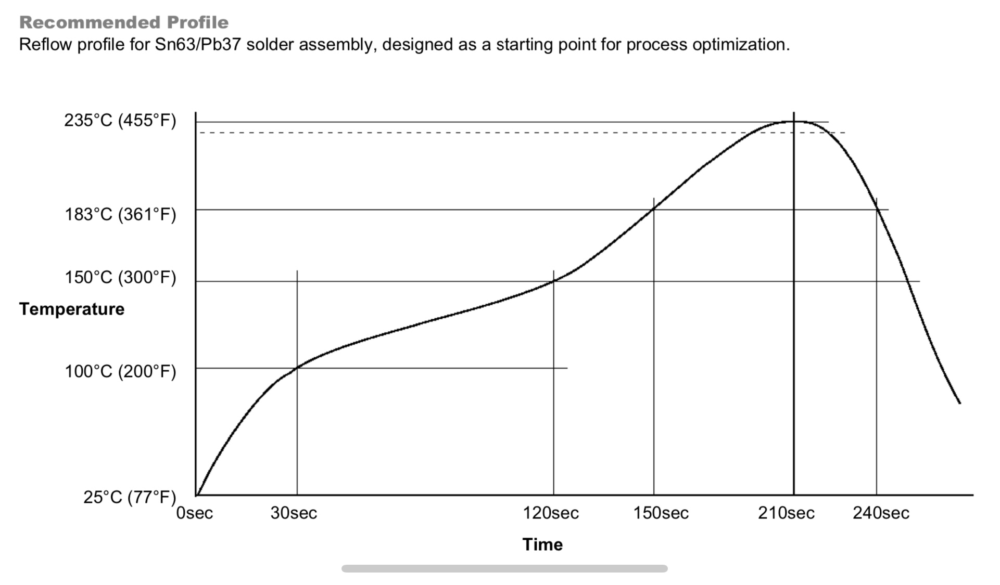

# Reflow_toaster
トースターを使ったリフロー  
## 目標
↓鉛入りはんだのリフロー温度プロファイル
  

鉛フリーなら250℃ぐらいまで上げた方がいいのかな～？でも210℃ちょっとでも部品少ない時なら割とうまくいったけど…   
高温にする時間を減らすために溶けだしてからすぐ取り出すよりも，ちょっと待って完全に溶かしきってから取り出すようにした方がいいかも．何回もリフローするのはダメージがでかそう
